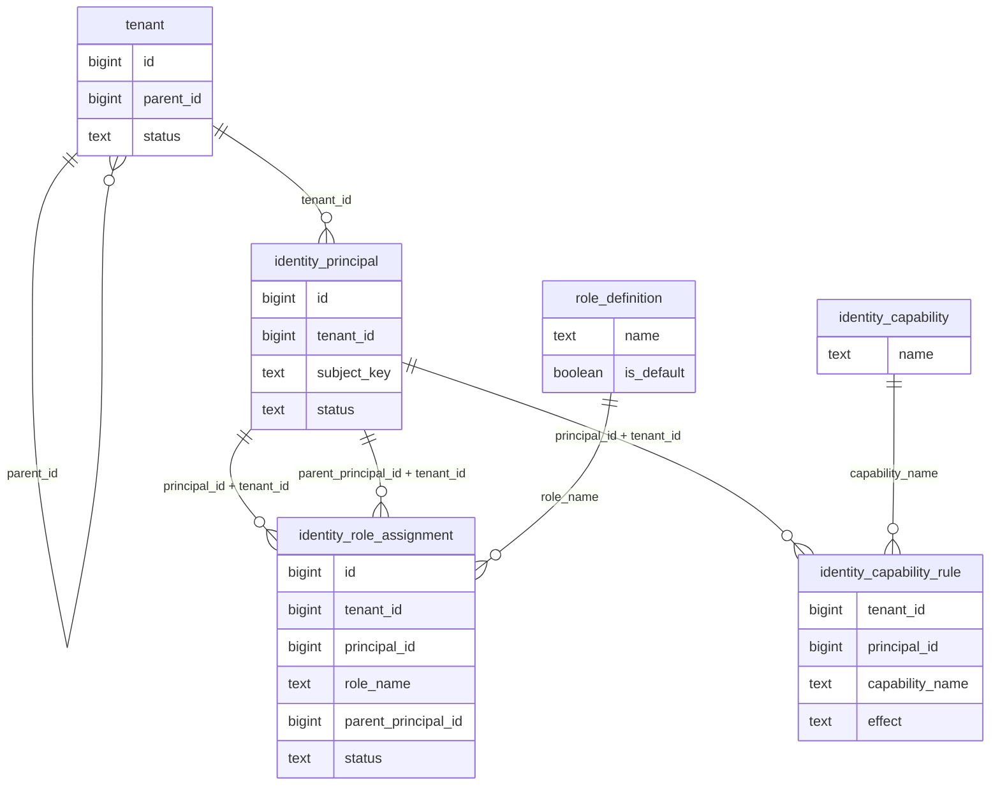

# Identity ER model (task 1.B.1)

Parent and child assignments share one `tenant_id`. The foreign key rejects a parent principal from another tenant.

Combined accounts hold Retailer and Customer on one principal. The merge unions only capabilities inside those roles' ceilings. The shipped ceilings are empty. An explicit deny removes a capability from that union.
